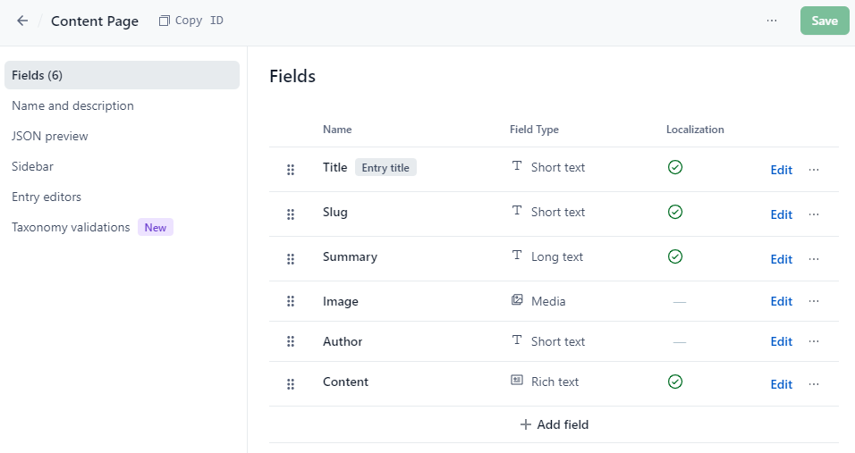

 

# Contentful Example Implementation

**This code is provided as an example only. It is not intended for production use.**

In order to use the generated classes from the `Contentful.ModelsGenerator.Cli` in your project, you need to properly configure the `ContentfulClient`. 
Take a peek at the [ContentfulClientBuilder](./ContentfulClientBuilder.cs) on how to do this.

Key takeaways are:
* `ResolveEntriesSelectively = true` and
* `ContentTypeResolver = new GeneratedContentTypeResolver()`

The `ContentPagesQuery` contains basic examples of how to query Contentful for entries of a specific content type.

## How to run this example

In order to run this example, you need to have a Contentful account and a space. 

1. Enter your Api Key, space id and enviroment in the [`appsettings.json`](./appsettings.json) file.
1. Create in Contentful a content type named "ContentPage" with the following field definitions:<br/><br/>Your content type definition should look like the **ContentPage definition in json** below.
1. Now create one or more entries of the type "ContentPage" in Contentful.
1. To update the generated classes, run the `contentful.modelsgenerator.cli` with the following arguments:<br/>`-k MY_APIKEY -s MY_SPACE_ID -e MY_ENVIRONMENT -ns Contentful.Implementation.Models -p C:\\\\YOUR\\PATH\\TO\\Shared.Contentful\\src\\Contentful.Implementation\\Models`<br/>You can modify these in `launchSettings.json` in the "Properties" folder of the `ModelsGenerator.Cli` project.


#### ContentPage definition in json
``` json
{
  "name": "Content Page",
  "description": "A default page for content",
  "displayField": "title",
  "fields": [
    {
      "id": "title",
      "name": "Title",
      "type": "Symbol",
      "localized": true,
      "required": true,
      "validations": [],
      "disabled": false,
      "omitted": false
    },
    {
      "id": "slug",
      "name": "Slug",
      "type": "Symbol",
      "localized": true,
      "required": true,
      "validations": [
        {
          "unique": true
        },
        {
          "size": {
            "min": 3,
            "max": 255
          },
          "message": "A slug must be at least three characters long and no longer than 255 characters "
        },
        {
          "regexp": {
            "pattern": "[a-z0-9-]",
            "flags": null
          },
          "message": "Only lowercase letters, digits and hyphens are alowed"
        }
      ],
      "disabled": false,
      "omitted": false
    },
    {
      "id": "summary",
      "name": "Summary",
      "type": "Text",
      "localized": true,
      "required": true,
      "validations": [
        {
          "size": {
            "max": 1024
          }
        }
      ],
      "disabled": false,
      "omitted": false
    },
    {
      "id": "image",
      "name": "Image",
      "type": "Link",
      "localized": false,
      "required": false,
      "validations": [
        {
          "linkMimetypeGroup": [
            "image"
          ]
        }
      ],
      "disabled": false,
      "omitted": false,
      "linkType": "Asset"
    },
    {
      "id": "author",
      "name": "Author",
      "type": "Symbol",
      "localized": false,
      "required": false,
      "validations": [],
      "disabled": false,
      "omitted": false
    },
    {
      "id": "content",
      "name": "Content",
      "type": "RichText",
      "localized": true,
      "required": false,
      "validations": [
        {
          "enabledMarks": [
            "bold",
            "italic",
            "underline",
            "code",
            "superscript",
            "subscript",
            "strikethrough"
          ],
          "message": "Only bold, italic, underline, code, superscript, subscript, and strikethrough marks are allowed"
        },
        {
          "enabledNodeTypes": [
            "heading-1",
            "heading-2",
            "heading-3",
            "heading-4",
            "heading-5",
            "heading-6",
            "ordered-list",
            "unordered-list",
            "hr",
            "blockquote",
            "embedded-entry-block",
            "embedded-asset-block",
            "table",
            "asset-hyperlink",
            "embedded-entry-inline",
            "entry-hyperlink",
            "hyperlink"
          ],
          "message": "Only heading 1, heading 2, heading 3, heading 4, heading 5, heading 6, ordered list, unordered list, horizontal rule, quote, block entry, asset, table, link to asset, inline entry, link to entry, and link to Url nodes are allowed"
        },
        {
          "nodes": {}
        }
      ],
      "disabled": false,
      "omitted": false
    }
  ],
  "sys": {
    "space": {
      "sys": {
        "type": "Link",
        "linkType": "Space",
        "id": "eu8yf2gt5cm4"
      }
    },
    "id": "contentPage",
    "type": "ContentType",
    "createdAt": "2024-08-23T14:09:32.832Z",
    "updatedAt": "2024-08-27T07:24:26.182Z",
    "environment": {
      "sys": {
        "id": "master",
        "type": "Link",
        "linkType": "Environment"
      }
    },
    "publishedVersion": 5,
    "publishedAt": "2024-08-27T07:24:26.182Z",
    "firstPublishedAt": "2024-08-23T14:09:33.239Z",
    "createdBy": {
      "sys": {
        "type": "Link",
        "linkType": "User",
        "id": "4eRA9wwsjGCZjJwywRlcfb"
      }
    },
    "updatedBy": {
      "sys": {
        "type": "Link",
        "linkType": "User",
        "id": "4eRA9wwsjGCZjJwywRlcfb"
      }
    },
    "publishedCounter": 3,
    "version": 6,
    "publishedBy": {
      "sys": {
        "type": "Link",
        "linkType": "User",
        "id": "4eRA9wwsjGCZjJwywRlcfb"
      }
    },
    "urn": "crn:contentful:::content:spaces/eu8yf2gt5cm4/environments/master/content_types/contentPage"
  }
}
```